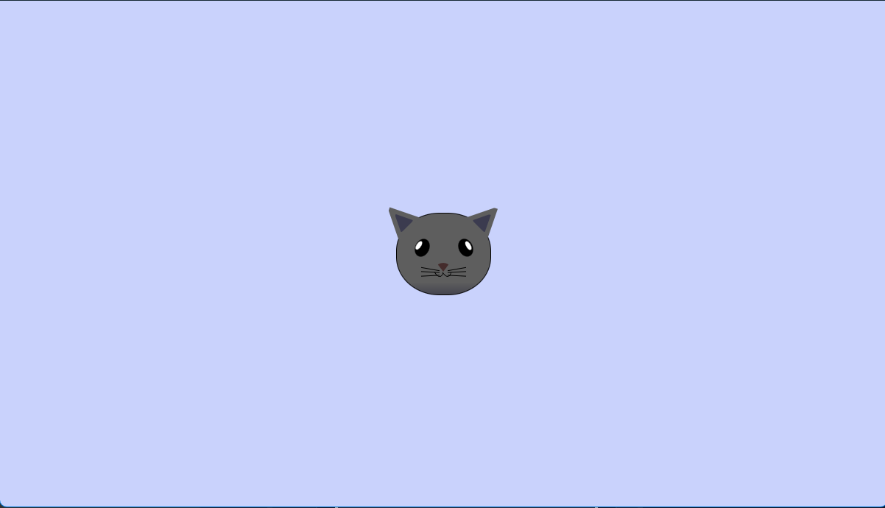

 🐱 Cat Painting

A pure HTML and CSS art project that visually renders a **cat face** using only `div` elements and styling. This project is part of the **freeCodeCamp** curriculum challenge for developing CSS layout and styling skills.

## 🚀 Features

- 🧱 Built entirely using HTML5 and CSS3
- 🐾 Detailed rendering of cat features (ears, eyes, nose, whiskers)
- 🎨 Responsive CSS layout using positioning and dimensions
- 💡 Great practice for box model, positioning, and nesting
- 📦 Clean structure using semantic HTML

## 🖼️ Screenshot

<html>
  
</html>
