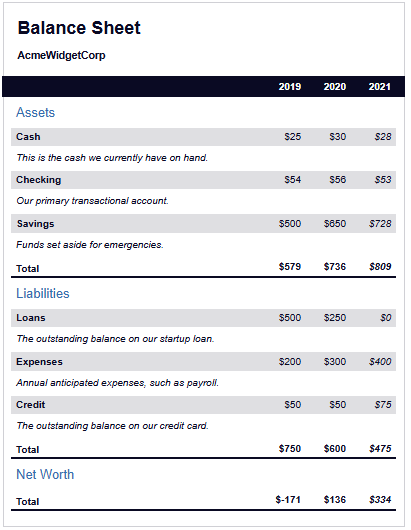

# 📊 AcmeWidgetCorp Balance Sheet

A semantic, accessible, and visually structured **balance sheet web page** built using **HTML and CSS**. This project was created to demonstrate financial data representation in a clean, responsive table layout, following best practices in accessibility and structure---

## 📄 Project Info

This project replicates a corporate-style balance sheet for the fictional company **AcmeWidgetCorp**, displaying **Assets**, **Liabilities**, and **Net Worth** for the years 2019 to 2021. The main purpose was to learn how to:

- Use semantic HTML tags for better structure and accessibility
- Create accessible tables with captions and screen reader-only elements
- Apply basic responsive styling using external CSS
- Structure complex data visually in a user-friendly format

## 🚀 Features

- ✅ Responsive layout with multiple financial tables
- ✅ Semantic HTML5 elements (`<section>`, `<main>`, `<thead>`, `<tbody>`, `<caption>`, etc.)
- ✅ Accessible labels and `sr-only` text for screen readers
- ✅ Consistent and clean design using external CSS
- ✅ Well-organized financial categories: Assets, Liabilities, and Net Worth

## 🖼️ Screenshot

<html>
  
</html>

## 📚 What I Learned

- Structuring complex tabular data using semantic HTML
- Enhancing accessibility with `aria-hidden`, `sr-only`, and descriptive labels
- Using `caption`, `thead`, `tbody`, and `th` correctly in data tables
- Applying consistent styling using an external CSS file
- Grouping and aligning elements using `div` and class names efficiently

## 🧠 Acknowledgements

- Inspired by the [freeCodeCamp Responsive Web Design Certification](https://www.freecodecamp.org/learn/)
- Thanks to the open source web community and documentation that helped in understanding accessibility and semantics better

## 💡 Future Improvements

- Add dynamic features with JavaScript (e.g., filter by year, animations)
- Create a dark/light mode toggle
- Integrate real-time financial data or user inputs

