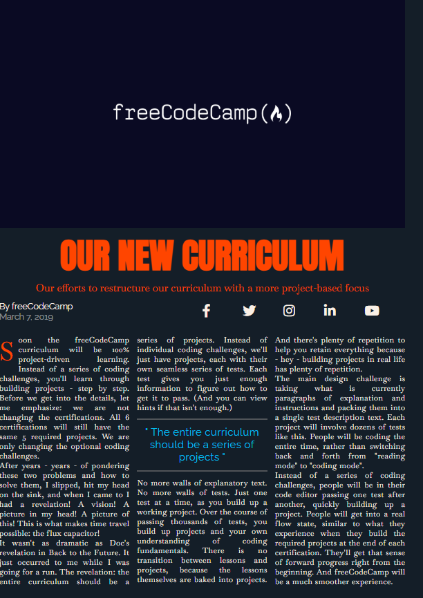
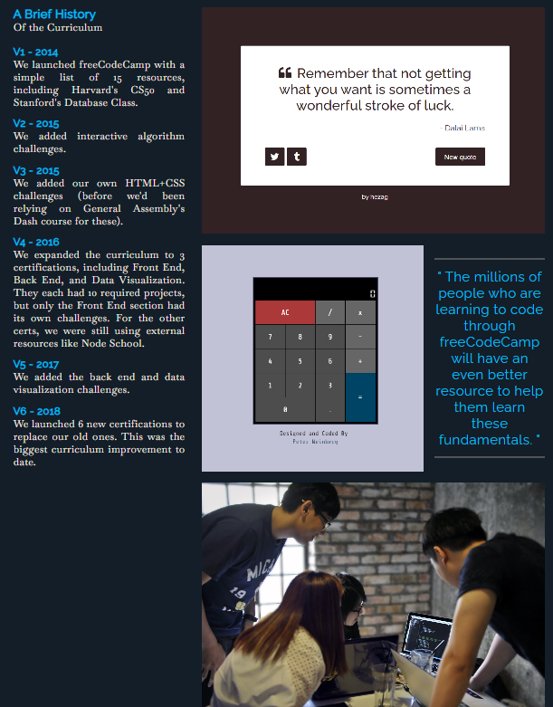

<html>
  <body>
    <h1>build a magazine article</h1>
    

      <ul>
        <li>CSS Grid gives you control over the rows and columns of your webpage design. </li>
        <li>In this course, you'll build a magazine article. You'll learn how to use CSS Grid, including concepts like grid rows and grid columns.</li>
      </ul>
    

    <section>
      
      
    </section>

  </body>
</html>
