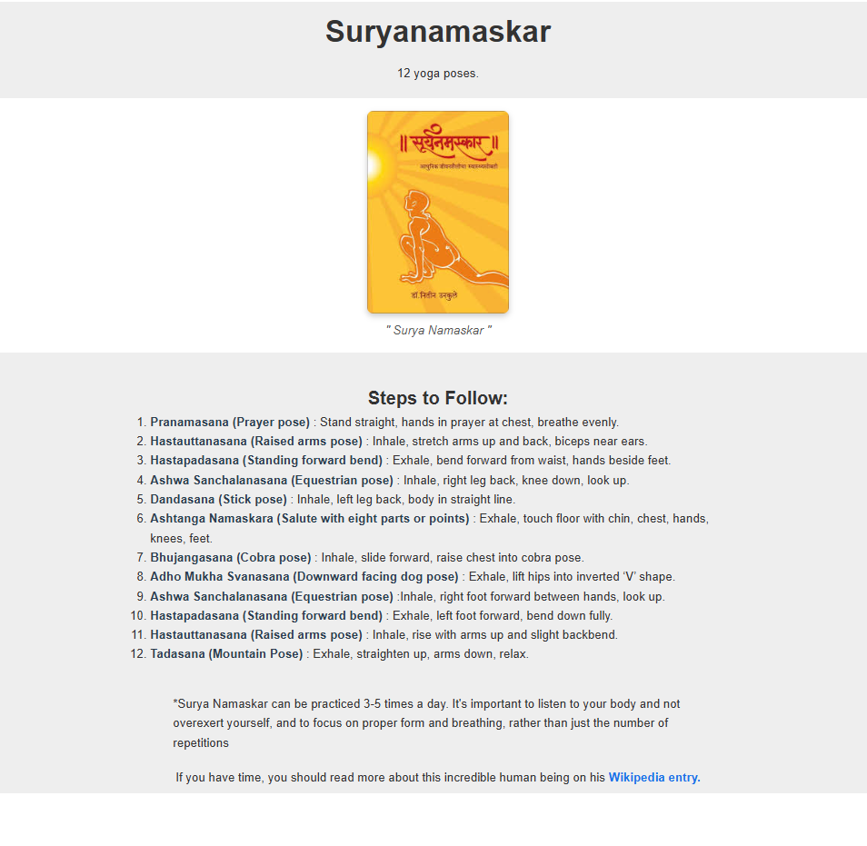

# Surya Namaskar Sequence – HTML/CSS Project

This project provides a structured and beautifully styled guide to the 12 steps of **Surya Namaskar** (Sun Salutation), a foundational sequence in yoga practice. Each step includes the Sanskrit name of the pose, a one-line description, and helpful tips. The layout is clean, readable, and mobile-friendly, using semantic HTML and external CSS.

## 🌟 Features

- 📜 Step-by-step breakdown of Surya Namaskar
- 🧘‍♀️ Sanskrit pose names in **bold**
- 🎨 External CSS for clean typography and spacing
- 📱 Centered layout with left-aligned readable text
- ✨ Easy to customize or embed in other yoga/fitness sites

## 📸 Screenshot
<!-- Replace with actual image path if available -->
<html>
  
</html>

## 🙏Acknowledgements
Inspired by traditional yoga practices and modern web design principles.
