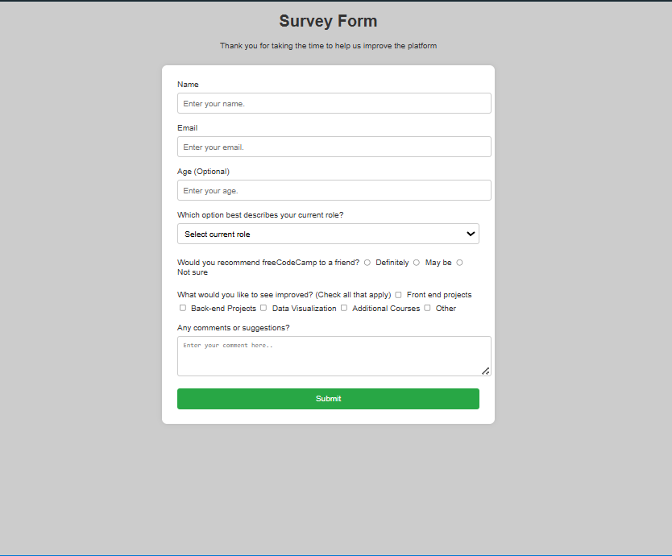

# 📝 Survey Form

A beginner-friendly web project that builds a clean and responsive **survey form** using HTML5 and CSS3. The form collects user information and preferences, designed to simulate feedback collection for a platform like freeCodeCamp.

## 🚀 Features

- ✅ Semantic HTML5 structure
- ✅ Labels linked with inputs for accessibility
- ✅ Client-side validation with `required`, `type`, `min`, and `max`
- ✅ Responsive layout using external CSS
- ✅ Covers all common input elements
- ✅ Includes text inputs, dropdowns, checkboxes, radio buttons, and textarea

## 🖼️ Screenshot

<html>
  
</html>

